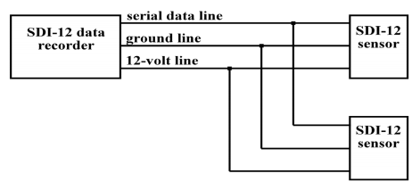
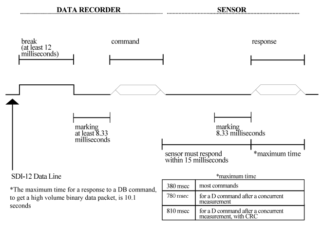
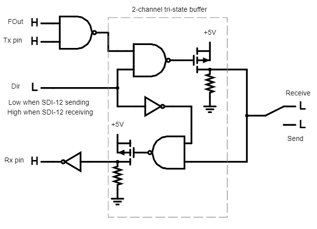

# SDI12-UART

Microcontroller independent implementation of SDI-12 over UART.
May also work for any sort of single wire communications protocol (not tested).

- [What is this?](#what-is-this)
- [What is SDI-12?](#what-is-sdi-12)
- [SDI-12 Protocol](#sdi-12-protocol)
  - [Electrical Interface](#electrical-interface)
  - [Communication](#communication)
- [Implementation](#implementation)
- [Glossary](#glossary)
- [References](#references)

---

## What is this?

After working on a project involving the use of SDI-12 sensors, I realised there was no SDI-12 library that was suitable for *any* microcontroller (well, any microcontroller that supports UART).
I was aware of the [Arduino-SDI-12](https://github.com/EnviroDIY/Arduino-SDI-12) library which was implemented entirely in software, but that uses the Arduino core library so would not work on *any* microcontroller.
(If you're working with Arduino, the Arduino-SDI-12 library may be the best if you're ok with the restrictions of the SoftwareSerial library).

The goal of this repository is to show a simple way to implement SDI-12 on *any* device with a UART driver.
"How?", you might ask.
Easy!
With hardware.

If you already know about SDI-12, feel free to skip to [Implementation](#implementation).

## What is SDI-12?

The SDI-12 (serial digial interface at 1200 baud) protocol was first released in 1988 designed by the US Geological Surbey's Hydrologic Instrumentation Facility and some private companies.
The SDI-12 specification is maintained by the SDI-12 Support group [1].

SDI-12 is a protocol often used for environmental monitoring due to it's low power operation.
It is intended for use in systems that are battery powered, low cost, and require a multiple sensors attached to one cable.
The SDI-12 protocol supports at least 10 sensors each with a cable length of 60 metres (200 feet).
One key reason for using SDI-12 sensors is that *all* SDI-12 sensors follow the protocol in the exact same way (barring slight differences between versions), so a variety of sensors can be used with little to no changes to the system [2].

## SDI-12 Protocol

*All information from [2]*.

### Electrical Interface

The SDI-12 protocol uses 2-3 wires to power and communicate with the sensor.
The figure below shows the bus connections.

It is possible to not connect the 12 V line on some sensors, however, that is outside the scope of this repository.

The serial data line is a bidirectional (half-duplex) data transfer line.
It uses inverted logic as shown in the table below.

| Condition | Binary State | Voltage Range |
| --- | --- | --- |
| marking | 1 | -0.5-1.0 V |
| spacing | 0 | 3.5-5.5 V |
| transition | undefined | 1.0-3.5 V |

The 12 V line must be supplied with between 9.6 V and 16 V.

### Communication

#### Data

The SDI-12 protocol specifies that data recorders and sensors communicate via the exchange of printable ASCII characters over the data line.
"Printable ASCII characters" range from \<space\> (hex: 20) to ~ (hex: 7E).
There are three exceptions to this rule:

- responses from a sensor end with a carriage return and linefeed (`\r\n` or \<CR\>\<LF\>)
- CRC codes may include some non-printable ASCII characters
- packets returned by the High Volume Binary command

None of these use the most significant bit, which means that each "byte" of data needs to only be represented by 7 bits.
The full format for an SDI-12 byte frame is:

- 1 start bit
- 7 data bits, LSB first
- 1 even parity bit
- 1 stop bit

The first byte of any message should be the sensor address.
This is `0` by default but can be changed to any number from `0`-`9`.
Some sensors may support additional addresses from `A`-`Z` and `a`-`z`.

Rather than explaining all the commands, I will just point you to page 8 (Table 5) of [[2]](http://www.sdi-12.org/current_specification/SDI-12_version-1_4-Jan-10-2019.pdf).
Note that all commands begin with the sensor address (or `?` for wildcard) and end with `!`.
Certain manufacturers may have additional commands, but the main command set should be unchanged.

#### Timing

The image below shows a timing diagram for the SDI-12 protocol.
The tolerance for all timing is &pm;0.40 ms.
The only exception is the time between the stop bit of one character and the start bit of the next which should not be more than 1.66 ms.

It should be noted that this diagram shows the **voltage levels** and not the **binary states**.
As in, a break is a period of spacing, which is a high voltage, but a low binary state.

The full communication protocol (for the data recorder) is explained below:

- data recorder sends a break by setting the data line to spacing (5 V) for at least 12 ms.
The sensor will never recognise a break less than 6.5 ms and will always recognise one greater than 12 ms.
- data recorder sends marking (0 V) for 8.33 ms.
This cannot be any longer than 100 ms otherwise sensors will go to sleep.
- data recorder sends the command to the sensor.
- data recorder gives up control of the data line within 7.5 ms of the end of the last stop bit and waits to receive data.

This must be repeated for every command if the sensors have fallen asleep again.
This occurs if a different sensor is addressed or if 87 ms of marking was detected by the sensor.

#### Retries (not yet implemented)

A data recorder must support retries.
A retry is needed if there was:

- no response from the sensor at least 16.67 ms after the last stop bit of the command.
- 8.33 ms of marking on the data line, after receiving the start bit of the response
- an invalid response

The first retry can be issued between 16.67 ms and 87 ms from the end of the last stop bit of the command.
If no valid response is received after retrying at least two times (with one retry more than 100 ms after the end of the break), the entire sequence of break and retries should be repeated two more times.

## Implementation

The implementation of SDI-12 was based heavily on the work done in [3].
The work I did can be found [here](https://jolonb.github.io/assets/pdf/final_report.pdf) if you're interested.
The goal is to make this information a bit more widely available and to provide alternate approaches for different microcontrollers.

There are so many types of microcontrollers so it's impossible to provide one solution for all of them.
This repository will showcase a few different ways to make it work.
Feel free to submit a pull request if you can add another design or make any changes to something.  
In any case, the base design will work for any microcontroller as the hardware works with standard UART.
Different designs can be created for specific use cases.

The standard implementation is shown below.

A simulation can be found [here](https://www.falstad.com/circuit/circuitjs.html?ctz=CQAgDOB0YzCsICMk4wCwCY0HY4A4c4M4FURSwAoRORJNNJANggy2YlfPMoDMQ2jRCwF48HJEhRQwGSgCVR4xAyVJEGcFrQQEnKHEoAnNYmxM1grYliUA5pfYYxAnVqomN4gMzeLXkG8Ca1tFAO8wIWcBbE19Nz13FD4kc0CMCHCMyWQ9aDkaOmILb2yzEuyuUnskaKCo8R19KgB3ATgSyPaLLE5KAEkJXoEnN05pQzarYeLXPrbhVjcA4db6ITSA8vBKBdUVBvWdqY7Av0CiM4s152U070vttfDzvAhfa4GQN6vmX-HqoU-ogNCAAJz+UFcXSUAAywOiAFphLVxJkQLwAIYAGwAzgBTbhUeEoiEgZEWMnorF4wl6Xaoo4gzQHY7qFn7UHMtnc7lk7lrB6aD4XTSzQWXWZC1KfNrSqXBcWUADKgUVpzQKPFWhpBK0cgAsiBNT03AxxKsBMl4SaYppzXb3BicXr6UaUSKKf8rYYST0wOIvRk0ZJdXSedFg38o89I8tIwGIxbE1s0lQAB7GxBgkZ0NBMMXsKIgeT4gDG+IAlgA3fGUTOYYUwY1kCLeY21EDK-EAOwAJvXyUx28RGHgEMRsB3QQAJSt2AAWAB1cS0F72V8qACL9ZEYFdGctV6uVnt2QeIphFbxT7A54bF2EAexaK7XG9x293GhXBP7p-PTNEWwTIMBzREgiQUpp00AAVdMVwAB1PC8mB8G9yW8RgsIgYt5AQ3FkJ7C9TgycDNQEUFiy3SsjFQzQwSnCD-GbYsADEAHkAFcABdKAAI3ZY1oO8RBxDwT5Mxods0mcTQ7xggRETLBdMR7Ht8WxFceKMStEVxHjMR4-EV34rjeF4fE6KAA).
The tri-state buffer shown in the simulation is only implemented as it is because the simulation tool does not have a dedicated tri-state buffer component. 
The configuration of it (with the internally inverted input) varies between chips.
Some are sold with a single inverted channel, while others will require external signal inversion.
This could be achieved by using another channel of the NAND gate.
In either case, the voltage on the Dir pin will be dependent on the configuration of the inverter.
As such, the Dir pin may need to be *HI* when the SDI-12 device is sending, as opposed to being *LO* in the simulation.
For consistency, the configuration in the simulation is the standard, as setting Dir to *LO* implies it is in a passive state, which the receive state is.  
In this implementation, you set the FOut pin *LO* to force a *HI* output (for sending a break).
While the FOut pin is *HI* (default state), the output will be the inverse of the Tx pin.
The truth table for this is shown below.

| FOut | Tx | OUT |
| --- | --- | --- |
| 0 | X | 1 |
| 1 | 0 | 1 |
| 1 | 1 | 0 |

When receiving, the Dir pin is set *LO* and data will be transmitted through the tri-state buffer and inverted to match the UART signals.

<!-- At the moment, there are 4 properties of the microcontroller you need to be aware of: inverted, reinitialisable, default voltage, and high voltage level.
Refer to the [glossary](#glossary) for definitions of these terms.

| Configuration | | Inverted | Reinitialisable | Default Voltage | High Voltage [V] |
| --- | --- | --- | --- | --- | --- |
| [1](hardware/config_1) | | No | No | LOW | 3.3 | -->

## Glossary

| Term | Meaning |
| --- | --- |
| CRC | Cyclic redundancy check, a form of error checking. |
| data recorder | The microcontroller being used to communicate with the sensor. |
| default voltage | The voltage (HIGH or LOW) on the Tx pin when not transmitting. This is almost always going to be HIGH, but it may vary for some microcontrollers. Only important if UART is not reinitialisable. |
| high voltage level | The voltage (in volts) of a HIGH signal. |
| inverted | In this context, refers to the UART driver outputting an inverted signal. This is likely the only case where default voltage is LOW. |
| reinitialisable | The ability for the UART to be initialised again after being deinitialised. |

## References

[1] Wikipedia Contributers, "SDI-12," Wikipedia, The Free Encyclopedia., 6 June 2017. [Online]. Available: [https://en.wikipedia.org/w/index.php?title=SDI-12&oldid=784017978](https://en.wikipedia.org/w/index.php?title=SDI-12&oldid=784017978). [Accessed 25 May 2020].  
[2] SDI-12 Support Group, "SDI-12 Specification," 10 January 2019. [Online]. Available: [http://www.sdi-12.org/specification.php](http://www.sdi-12.org/specification.php). [Accessed 2020 May 25].  
[3] A. Saari, S. A. Hinzey, J. R. Frigo, M. C. Proicou and L. Borges, "Using SDI-12 with ST microelectronics MCU's", Los Alamos National Lab, Los Alamos, 2015.  
