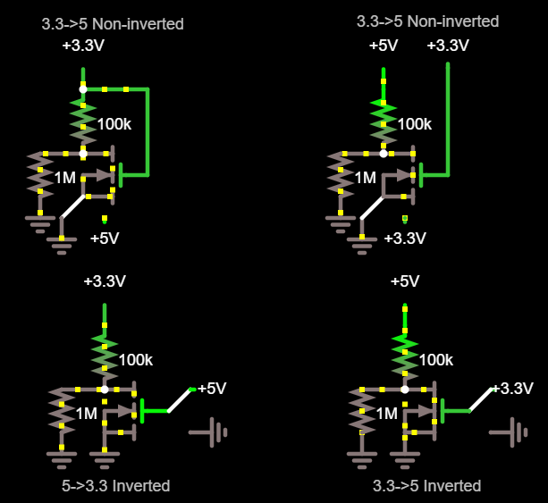

# Hardware

The purpose of this document is to provide information about the different components used in the systems.
By breaking them down, it means the sections are modularised and can be built up to create the same functionality as required for any microcontroller.

This section may be a little bit theory heavy. Working is shown in case there's a mistake so people can correct it.
However, if you want to skip straight to the implementation, go to the last equation.

## Level shifter 3.3 -> 5

The most energy efficient level shifter design I could come up with is shown below.
It uses two inverting stages to lower the current draw as much as possible.
This level shifter is unidirectional as there is no need for it to be bidirectional.

When , the lower left nMOS will be in the linear/non-saturation/ohmic/triode region, so the current through it is given by the equation:

We will look at the left half of the circuit first.
We know that the current through the resistor is  and that  at all times.

If we equate these and rearrange, we get:

We now know the input into the CMOS inverter is equal to .
Assuming the resistance is large (>1k), we know that the actual value of  is the lower solution to the quadratic.
Interestingly, the upper solution is <5V, so is technically valid but would not be the correct solution.
Therefore, we have:

Therefore, the current through the left branch is:

This is the current when 

We will call the nMOS with the resistor  and the nMOS and pMOS  and  respectively from now on.
