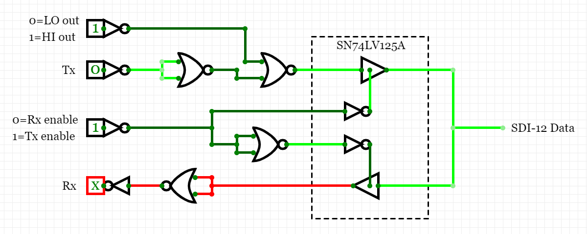

# Hardware

The purpose of this document is to provide information about the different components used in the systems.
By breaking them down, it means the sections are modularised and can be built up to create the same functionality as required for any microcontroller.

Some sections may be a little bit theory heavy.
Working is shown in case there are mistakes so people can correct them and to provide a bit more information for those interested.
The equations provide help for minimising current in power critical situations (such as battery power, which SDI-12 sensors may be connected to).
However, if you want to skip straight to the implementation, just look at the schematic image.

## Level shifter

The most energy efficient level shifter designs I could come up with is shown below.
This assumes it is being fed into a high impedance input, such as a microcontroller or the gate of another MOSFET.
The level shifters are unidirectional as there is no need for them to be bidirectional.
The 1 M&Omega; resistors represent the load, which should be high impedance.
The 100 k&Omega; resistors can be increased to reduce the current, but increasing them too far will cause it to output the wrong voltage.

There are some instructions below for selecting the resistor for the 3.3->5 Inverted level shifter, but this information may also apply to all the other designs.
This does require extra information about the device the output is going in to, so may not be useful in most instances.

  
[Link to simulation](https://www.falstad.com/circuit/circuitjs.html?cct=$+1+0.000005+7.010541234668786+72+5+43%0Af+48+160+16+160+32+1.5+0.02%0Ar+16+144+16+96+0+100000%0AR+16+96+16+64+0+0+40+3.3+0+0+0.5%0Aw+64+160+64+96+0%0Aw+64+96+16+96+0%0AS+16+176+16+192+0+1+false+0+2%0Ag+0+192+0+208+0%0AR+32+192+32+208+0+0+40+5+0+0+0.5%0Aw+16+144+-16+144+0%0Aw+48+160+64+160+0%0Aw+64+336+80+336+0%0Aw+32+320+0+320+0%0Ag+32+352+32+368+0%0AR+32+272+32+240+0+0+40+3.3+0+0+0.5%0Ar+32+320+32+272+0+100000%0Af+64+336+32+336+32+1.5+0.02%0AS+80+336+96+336+0+0+false+0+2%0AR+96+320+112+320+0+0+40+5+0+0+0.5%0Ag+96+352+112+352+0%0Ag+320+352+336+352+0%0AR+320+320+336+320+0+0+40+3.3+0+0+0.5%0AS+304+336+320+336+0+0+false+0+2%0Af+288+336+256+336+32+1.5+0.02%0Ar+256+320+256+272+0+100000%0AR+256+272+256+240+0+0+40+5+0+0+0.5%0Ag+256+352+256+368+0%0Aw+256+320+224+320+0%0Aw+288+336+304+336+0%0Aw+272+160+288+160+0%0Aw+240+144+208+144+0%0AR+256+192+256+208+0+0+40+3.3+0+0+0.5%0Ag+224+192+224+208+0%0AS+240+176+240+192+0+1+false+0+2%0AR+240+96+240+64+0+0+40+5+0+0+0.5%0Ar+240+144+240+96+0+100000%0Af+272+160+240+160+0+1.5+0.02%0AR+288+80+288+64+0+0+40+3.3+0+0+0.5%0Aw+288+80+288+160+0%0Ax+-15+51+91+54+4+12+3.3-%3E5%5CsNon-inverted%0Ax+0+396+81+399+4+12+5-%3E3.3%5CsInverted%0Ax+220+49+326+52+4+12+3.3-%3E5%5CsNon-inverted%0Ax+232+396+313+399+4+12+3.3-%3E5%5CsInverted%0Ag+-16+176+-16+192+0%0Ar+-16+144+-16+176+0+1000000%0Ar+0+320+0+352+0+1000000%0Ag+0+352+0+368+0%0Ag+224+352+224+368+0%0Ar+224+320+224+352+0+1000000%0Ag+208+176+208+192+0%0Ar+208+144+208+176+0+1000000%0Ao+2+64+0+4099+5+0.00009765625+0+2+2+3%0Ao+13+64+0+4099+5+0.00009765625+1+2+13+3%0Ao+33+64+0+4099+5+0.00009765625+2+2+33+3%0Ao+24+64+0+4099+5+0.00009765625+3+2+24+3%0A)

The image below shows the output of the level shifter being fed into the input of a CMOS inverter.

  
[Link to simulation](https://www.falstad.com/circuit/circuitjs.html?cct=$+1+0.000005+16.817414165184545+84+5+43%0Aw+272+208+272+192+0%0Af+240+240+272+240+32+1.5+0.02%0Aw+272+144+352+144+0%0Aw+352+144+352+160+0%0Ag+208+256+192+256+0%0AR+208+224+192+224+0+0+40+3.3+0+0+0.5%0AS+224+240+208+240+0+0+false+0+2%0Aw+240+240+224+240+0%0Ag+272+256+272+272+0%0Aw+352+208+384+208+0%0Af+320+240+352+240+32+1.5+0.02%0Aw+320+240+304+240+0%0Af+320+176+352+176+33+1.5+0.02%0Ag+352+256+352+272+0%0Aw+352+208+352+224+0%0Aw+320+176+304+176+0%0Aw+304+176+304+208+0%0Aw+352+208+352+192+0%0Aw+304+208+304+240+0%0Aw+272+224+272+208+0%0Aw+272+208+304+208+0%0Aw+272+160+272+144+0%0AR+272+144+272+128+0+0+40+5+0+0+0.5%0Ar+272+192+272+160+0+1000000%0Ao+22+64+3+4099+5+0.00009765625+0+1%0A38+23+0+1000000+10000000+Resistance%0A)

---

If you want to work out the value of the resistor, follow these "steps" (or just skip to the end for the final equations).

When , the lower left nMOS will be in the linear/non-saturation/ohmic/triode region, so the current through it is given by the equation:

We will look at the left half of the circuit first.
We know that the current through the resistor is  and that  at all times.

If we equate these and rearrange, we get:

We now know the input into the CMOS inverter is equal to .
Assuming the resistance is large (>1k), we know that the actual value of  is the lower solution to the quadratic.
Interestingly, the upper solution is <5V, so is technically valid but would not be the correct solution.
Therefore, we have:

Therefore, the current through the left branch is:

when 

The calculation for when  is a bit different in that it sets an upper bound for the resistance provided by the resistor. 
You need to know the value of  for the transistor.
To simplify the explanation, this is the maximum current while the transistor is off and the value can be found on the datasheet.
Knowing this, we need to set the resistance such that  I_{dss}">.
Remember,  is the max current, so the current through the resistor will be limited to this value if a low enough resistance is selected.
We can write this as  I_{dss} \Rightarrow R < \frac{V_{dd}-V_{ds}}{I_{dss}}">.
Assuming this condition is satisfied, then 

In short, the current through the left branch is  when  and  when .
 can be written as  and , respectively.

The next step is to feed the output of the circuit into the right branch.
This will allow you to find the optimal values to minimise the current from the source because if the output voltage is too low, the pMOS transistor will switch to the linear/saturation region. A pMOS transistor is in the off state when  V_{t_p}">.
We know that  and  can be found on the datasheet.
Therefore, we have a requirement that  V_{t_p}">.
The overall current of the circuit appears to be the lowest when the pMOS is on the edge of the cutoff region (it's probably best to give it a bit of breathing room though).

There's still a bit more work to do.
To get a rough idea of a resistance to use, look at [this graph](https://www.desmos.com/calculator/3hmn6u5ff4). 
The resistance is on the x-axis and should not be greater than the point at which the red and purple lines intersect.
Past the intersection point, the pMOS is in linear/saturation.
The blue line represents the current (though multiplied by 100,000) through the left nMOS.
We can assume that if the pMOS is in the cutoff region that the right branch has minimal current () therefore you only need to minimise the blue current curve.
As mentioned before, give a bit of breathing room. The default configuration in the graph would be best at 6 M&Omega;.
Make sure you play around with the values in Desmos to get the optimal value for your MOSFETs.

## Inverter

  
[Link to simulation](https://www.falstad.com/circuit/circuitjs.html?cct=$+1+0.000005+16.817414165184545+84+5+43%0Aw+352+144+352+160+0%0Ag+272+224+256+224+0%0AR+272+192+256+192+0+0+40+5+0+0+0.5%0AS+288+208+272+208+0+1+false+0+2%0Aw+352+208+384+208+0%0Af+320+240+352+240+32+1.5+0.02%0Aw+320+240+304+240+0%0Af+320+176+352+176+33+1.5+0.02%0Ag+352+256+352+272+0%0Aw+352+208+352+224+0%0Aw+320+176+304+176+0%0Aw+304+176+304+208+0%0Aw+352+208+352+192+0%0Aw+304+208+304+240+0%0AR+352+144+352+128+0+0+40+5+0+0+0.5%0Aw+288+208+304+208+0%0Ao+14+64+3+4099+5+0.00009765625+0+1%0A)

This is a basic CMOS inverter.
This does not have a level shifting stage because the input is already 5 V.

## Tristate Buffer

### Suggested chips

| Part number | Package |
| --- | --- |
| [SN74LV125A](http://www.ti.com/lit/ds/symlink/sn74lv125a.pdf) | TVSOP, SOIC, SOP, SSOP, TSSOP, DIP |
| [SN74LVC2G125](http://www.ti.com/lit/ds/symlink/sn74lvc2g240.pdf) | SM8, VSSOP, DSBGA |
| [SN74LVC2G241](http://www.ti.com/lit/ds/symlink/sn74lvc2g241.pdf) | SM8, VSSOP, DSBGA |

There are some differences between these buffers.
All examples will use **SN74LV125A**, so be aware of any changes you may need to make.
The other chips may be better if you don't need a DIP package as they only have two buffers rather than four.

## Basic Circuit

The following image shows a basic circuit which would work for configuration 1.
This section aims to explain how to modify this circuit to work for any other configuration.

  
[Link to "simulation"](https://circuitverse.org/users/21100/projects/95794)

Notes:

- the inverters at the inputs represent the level shifting inverters.
  - these are all inverting because inverting level shifters have a lower current draw.
- only one NOR gate is used for its intended function, the rest are used as inverters
- if the default Tx voltage is 0, place the NOR inverter *before* the NOR gate (as shown); if the default Tx voltage is 1, place the NOR inverter *after* the NOR gate.
- the inverter does not need to be on the Rx buffer enable pin (as shown), it could be connected to the Tx which would invert the control.